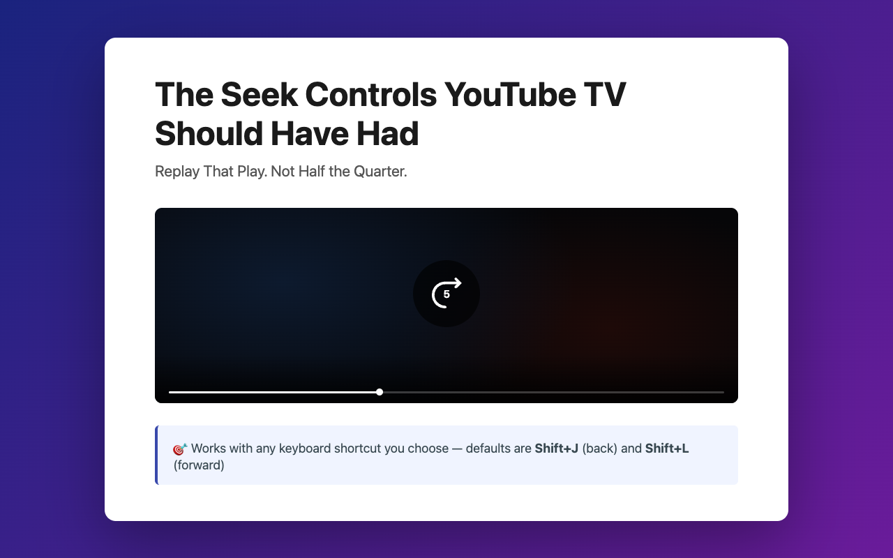

#  Smart Seek for YouTube TV

A Chrome, Edge, Firefox, and Safari extension that adds configurable seek
controls to [YouTube TV](https://tv.youtube.com).

YouTube TV's built-in keyboard shortcuts only jump 15 seconds at a time. Smart
Seek lets you jump by any amount you choose — 5 seconds by default.



---

## Key bindings

| Action        | Configurable default | Always active |
| ------------- | -------------------- | ------------- |
| Seek backward | `Shift+J`            | `Shift+←`     |
| Seek forward  | `Shift+L`            | `Shift+→`     |

The configurable bindings can be changed in the options page. The `Shift+Arrow`
bindings are always active regardless of your settings.

---

## Configuration

**Popup** — Click the extension icon for a quick seek-amount adjustment (+/− 0.5
s per click).

**Options page** — Right-click the extension icon → _Options_ (or open it from
the popup) for full control:

| Setting       | Default   | Description                               |
| ------------- | --------- | ----------------------------------------- |
| Seek amount   | `5`       | Seconds to seek per key press (0.1 – 300) |
| Seek backward | `Shift+J` | Configurable hotkey                       |
| Seek forward  | `Shift+L` | Configurable hotkey                       |

Settings sync across devices via `chrome.storage.sync`.

---

## Installation

Download the latest build from
[GitHub Releases](https://github.com/gormanity/smart-seek-extension/releases),
or [build from source](#build) if you prefer.

<details>
<summary>Chrome</summary>

1. Download `smart-seek-{version}-chrome.zip` and unzip it
2. Go to `chrome://extensions`
3. Enable **Developer mode** (top-right toggle)
4. Click **Load unpacked** → select the unzipped folder

</details>

<details>
<summary>Edge</summary>

1. Download `smart-seek-{version}-edge.zip` and unzip it
2. Go to `edge://extensions`
3. Enable **Developer mode** (left sidebar toggle)
4. Click **Load unpacked** → select the unzipped folder

</details>

<details>
<summary>Firefox</summary>

1. Download `smart-seek-{version}-firefox.zip` and unzip it
2. Go to `about:debugging#/runtime/this-firefox`
3. Click **Load Temporary Add-on** → select `manifest.json` in the unzipped
   folder

> **Note:** Temporary add-ons in Firefox are removed when the browser closes.
> For a persistent install, build a signed `.xpi` via `make pack`.

</details>

<details>
<summary>Safari (macOS)</summary>

1. Download `smart-seek-{version}-safari-macos.zip` and unzip it
2. Right-click **Smart Seek for YouTube TV.app** → **Open** to bypass Gatekeeper
   (required once for unsigned apps; alternatively run
   `xattr -dr com.apple.quarantine "Smart Seek for YouTube TV.app"`)
3. In Safari: **Settings → Advanced** → enable **Show features for web
   developers**
4. In the **Develop** menu: enable **Allow Unsigned Extensions** (requires your
   password)
5. The app window prompts you to enable the extension — go to **Safari →
   Settings → Extensions** and check **Smart Seek for YouTube TV**

> **Note:** "Allow Unsigned Extensions" resets every time Safari restarts and
> must be re-enabled.

</details>

---

## Development

### Prerequisites

- Node.js 20+, npm 10+

### Setup

```bash
npm install
```

### Commands

```bash
make build      # compile TypeScript and copy assets → dist/
make typecheck  # tsc --noEmit (type errors only)
make lint       # ESLint
make test       # Vitest (125 tests)
make check      # typecheck + lint + test
make pack       # dist/smart-seek-{version}-{chrome,edge,firefox}.zip
make safari     # dist/smart-seek-{version}-safari-macos.zip  (macOS only; requires Xcode)
make watch      # Vitest in watch mode
```

### Project layout

```
src/
  content/      seek-controller.ts   content script (key handler + OSD)
                seek-logic.ts        pure functions (key parsing, seeking)
  options/      options.ts           settings page logic
  popup/        popup.ts             toolbar popup
  background/   service-worker.ts   install defaults
tests/          *.test.ts            Vitest unit tests
scripts/        build.js  pack.js   build tooling
dist/                               built extension (git-ignored)
```

See [PROJECT.md](PROJECT.md) for full architecture notes.

---

## License

MIT — see [LICENSE](LICENSE).
